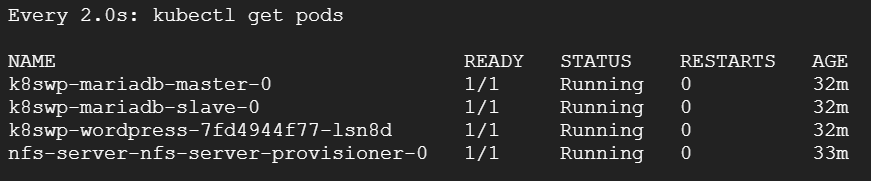
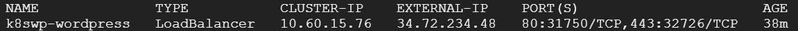

# k8swppty-meetup

## Requerimientos para levantar Wordpress en K8s

- Algun cluster en la nube ([AKS][aks], [GKE][gke], [EKS][eks])
- Cliente de [kubectl][kubectl]
- Cliente de [Helm][helm]

## Repositorio de HELM

Usaremos el repositorio de [helm de bitnami][bitwp] y ademas el repo de [stable de nfs-server][nfs] para poder tener mas de una replica de wordpress en kubernetes.

## Agregar repo a helm y actualizar

```bash
$ helm repo add bitnami https://charts.bitnami.com/bitnami
$ helm repo add stable https://kubernetes-charts.storage.googleapis.com
$ helm repo update
```

## Despliegue de Wordpress

Crearemos un wordpress altamente reduntante que contendra 2 base de datos replicadas, para poder aumentar replicas tendriamos que hacer que wp-content este en un compartido nsf que puedan accesar mas de un contenedor. El comando para levantar la solucion en una solucion de nube es el siguiente:

```bash
$ helm install nfs-server stable/nfs-server-provisioner --set persistence.enabled=true,persistence.size=25Gi
$ helm upgrade k8swp bitnami/wordpress --set mariadb.replication.enabled=true,persistence.accessMode=ReadWriteMany,global.storageClass=nfs,wordpressFirstName=Wordpress,wordpressLastName="en Kubernetes",wordpressBlogName="Wordpress en K8s",wordpressEmail=wordpress@k8s.com
```

## Prueba de servicios

Para poder accesar nuestro wordpress contenerizado tendremos que verificar que los pods este `running` para verifficar el estado ponemos el siguiente comando:

```bash
$ watch kubectl get pods
```

Debera parecer una pantalla donde mostrara en este caso 4 pods:



Espere que todo estara cambiando de estado pero todo estara arriba cuando el `STATUS` este en `Running` y `READY` diga `1/1` en todas los pods. Para poder conectarnos a wordpress vamos a tener que sacar el ip publico escribimos el siguiente comando:

```bash
$ kubectl get svc --namespace default -w k8swp-wordpress
```

Le aparecera el detalle del servicio que contendra el ip publico par poder conectarse a wordpress. La ip publica aparecera en donde dice `EXTERNAL-IP`



Solo es necesario poner el Ip en un navegadore y tendriamos acceso a wordpress.

## Accesar al portal de administracion

El usuario para entrar como administrador es `user` pero el password se encuentra en un secreto para poder obtener el secreto se ejecuta el siguiente comando:

```bash
echo Password: $(kubectl get secret --namespace default k8swp-wordpress -o jsonpath="{.data.wordpress-password}" | base64 --decode)
```

## Ejecutar comandos de wp-cli

```bash
kubectl exec $(kubectl get pods -l app.kubernetes.io/name=wordpress -o jsonpath='{.items[0].metadata.name}') -c wordpress -- wp maintenance-mode activate
```

## Aumentar las replicas

```bash
helm upgrade k8swp bitnami/wordpress --set replicaCount=3,mariadb.replication.enabled=true,persistence.accessMode=ReadWriteMany,global.storageClass=nfs,wordpressFirstName=Wordpress,wordpressLastName="en Kubernetes",wordpressBlogName="Wordpress en K8s",wordpressEmail=wordpress@k8s.com
```

## Comentarios

El demo esta pensado en hacerse en una solucion en la nube pero tambien se puede hacer en soluciones locales como[Minikube][mkinst], [microk8s][mk8s], [docker for windows][dw] con k8s habilitado, [docker for mac][dm] con k8s habilitado. Pero sera necesario crear un `ingress controller` para que funciones correctamente ademas de cambiar el service a `ClusterIP` 

[mkinst]: https://github.com/kubernetes/minikube
[mk8s]: https://microk8s.io/
[dw]: https://docs.docker.com/docker-for-windows/install/
[dm]: https://docs.docker.com/docker-for-mac/install/
[aks]: https://azure.microsoft.com/en-us/services/kubernetes-service/
[gke]: https://cloud.google.com/kubernetes-engine
[eks]: https://aws.amazon.com/es/eks/?whats-new-cards.sort-by=item.additionalFields.postDateTime&whats-new-cards.sort-order=desc&eks-blogs.sort-by=item.additionalFields.createdDate&eks-blogs.sort-order=desc
[kubectl]: https://kubernetes.io/docs/tasks/tools/install-kubectl/
[helm]: https://helm.sh/docs/intro/install/
[bitwp]: https://github.com/bitnami/charts/tree/master/bitnami/wordpress
[nfs]: https://github.com/helm/charts/tree/master/stable/nfs-server-provisioner
